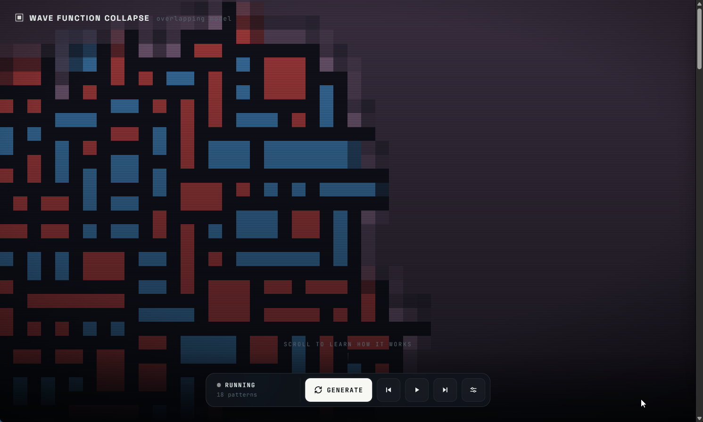
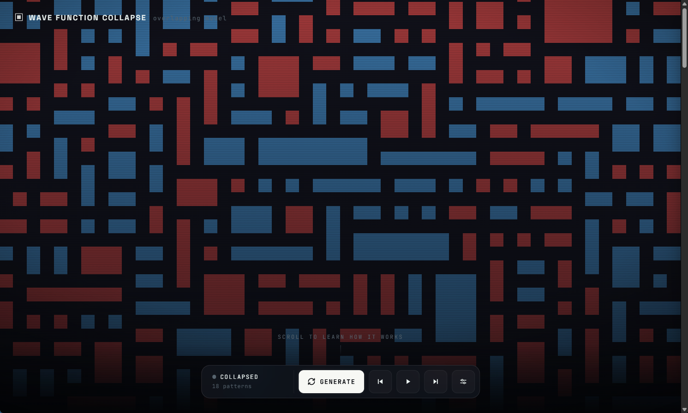
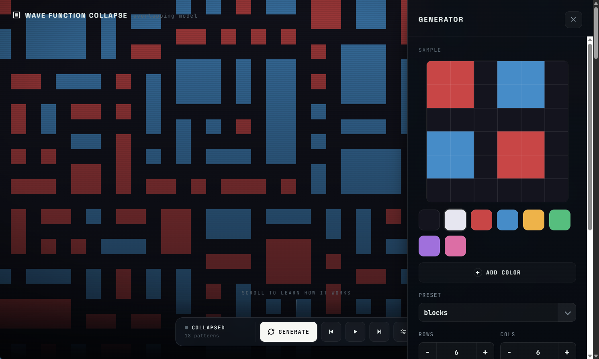
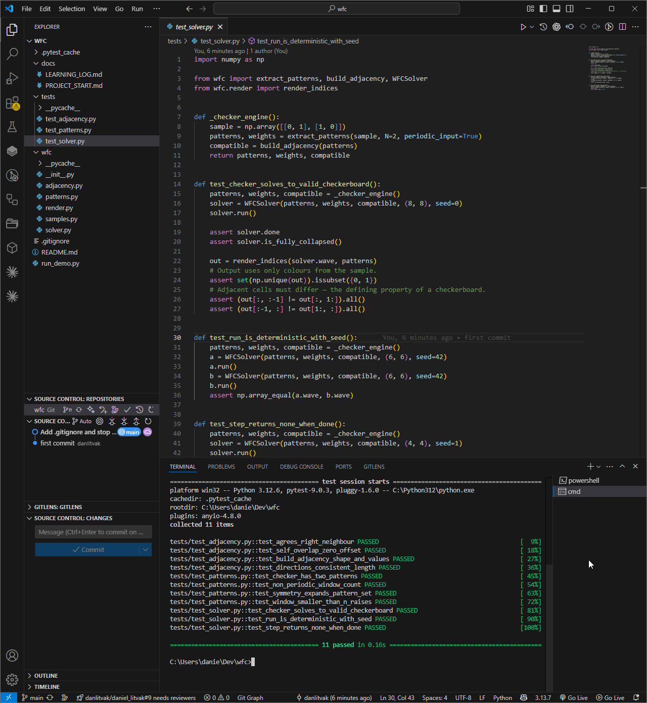

# WFC Visualizer

An efficient, live-interactive **Wave Function Collapse** visualizer for the web.
The output canvas animates an overlapping WFC solve while the settings drawer
lets you paint a source sample, adjust pattern size and symmetry, customize the
palette, and step through the solve from the initial wave state.

The WFC engine is real Python + numpy. It runs in the browser via
[Pyodide](https://pyodide.org/) (Python compiled to WebAssembly), so the whole
thing is hosted as static files on GitHub Pages — no server, no per-step network
round-trips, smooth animation over thousands of steps.

> Personal learning project / portfolio piece. Build progress and the reasoning
> behind each decision are logged in [`docs/LEARNING_LOG.md`](docs/LEARNING_LOG.md).

**▶ Live demo: https://danlitvak.github.io/wfc/**

## Screenshots

<table>
  <tr>
    <td width="50%">
      
      <br>
      <sub>Output mid-solve, with unresolved cells still averaging possible pattern colours.</sub>
    </td>
    <td width="50%">
      
      <br>
      <sub>Fully collapsed output after the wave has resolved to one pattern per cell.</sub>
    </td>
  </tr>
  <tr>
    <td width="50%">
      
      <br>
      <sub>Settings drawer with sample editor, palette controls, presets, symmetry, and output controls.</sub>
    </td>
    <td width="50%">
      
      <br>
      <sub>Python test suite passing for pattern extraction, adjacency, rendering, and solver behaviour.</sub>
    </td>
  </tr>
</table>

## How it works

Overlapping WFC, in four steps:

1. **Pattern extraction** — slide an N×N window over the sample and collect the
   unique patterns plus how often each occurs (its weight).
2. **Adjacency** — precompute, for every pattern pair and the four cardinal
   directions, whether their overlap agrees (so propagation is a table lookup).
3. **Solve loop** — every output cell holds a boolean mask of still-possible
   patterns. Repeatedly collapse the lowest-entropy cell (weighted random) and
   propagate the constraints to neighbours until stable.
4. **Contradiction handling** — if a cell runs out of options, restart.

```
wfc/
├─ patterns.py    extract N×N patterns + weights (with optional D4 symmetry)
├─ adjacency.py   overlap-agreement check → compatible[4, T, T] table
├─ solver.py      wave grid, observe/collapse + propagate, Contradiction
├─ render.py      wave state → colour indices / averaged RGB
└─ samples.py     hardcoded samples + palette
```

The `wfc/` package is plain Python — the browser build just imports the same
code through Pyodide.

The web UI keeps a long-lived Python session in Pyodide for Play/Pause/Step.
Generate creates a fresh session and starts playback; Step 0 creates the same
fresh session but leaves it paused so the initial all-possible wave can be
inspected manually.

## Running locally

Requires Python 3.12+ and numpy.

```bash
# install runtime/test dependencies
python -m pip install numpy pytest

# run the test suite (from the project root)
python -m pytest

# terminal demo (renders to the console with ANSI colours)
python run_demo.py blocks --n 2 --size 16 32 --seed 7
```

Use `python -m pytest` rather than a bare `pytest`: the `-m` form puts the
project root on `sys.path` so `import wfc` resolves, and it avoids the
"Scripts not on PATH" warning on a fresh pytest install.

Handy variants:

```bash
python -m pytest -v                    # verbose: one line per test
python -m pytest -q                    # quiet: just the summary
python -m pytest tests/test_solver.py  # a single file
python -m pytest -k checker            # only tests whose name matches "checker"
python -m pytest -x                    # stop at the first failure
```

`run_demo.py` options: `sample` (`maze` | `pipes` | `blocks` | `checker`),
`--n` pattern size, `--size H W` output grid, `--seed`, `--symmetry` (1–8),
`--attempts` restarts.

## Running the web app locally

The browser build fetches the `wfc/*.py` files over HTTP, so it needs a static
server (opening `index.html` with `file://` won't work). From the project root:

```bash
python -m http.server 8000
# then open http://127.0.0.1:8000/  (redirects to the app under /web/)
```

## Deployment (GitHub Pages)

The site is served straight from the repo — no build step.

- **Settings → Pages → Source: “Deploy from a branch” → `main` / `root`.**
- `.nojekyll` (repo root) disables Jekyll. This is required: Jekyll skips files
  beginning with `_`, which would drop `wfc/__init__.py` and break the import.
- The root `index.html` redirects to `web/`, which `fetch()`es the package from
  `../wfc/` — i.e. `https://<user>.github.io/wfc/wfc/*.py`.

## Documentation

- [`docs/PROJECT_START.md`](docs/PROJECT_START.md) — original scope, architecture
  decision (why Pyodide), and milestones.
- [`docs/LEARNING_LOG.md`](docs/LEARNING_LOG.md) — dated build timeline with the
  reasoning and concepts learned along the way.
- [`docs/TODO.md`](docs/TODO.md) — follow-up SEO and portfolio integration notes.

## License

[MIT](LICENSE) © Daniel Litvak
